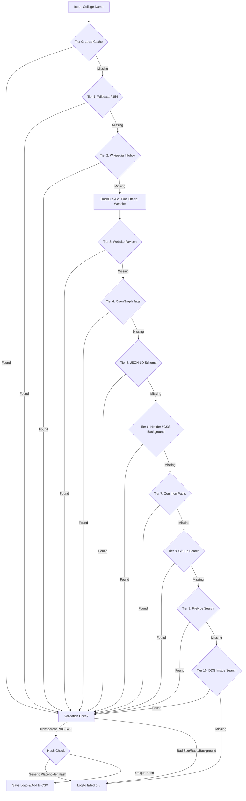

# College Logo Dataset Scraper

This repository contains a Python-based, multi-tiered web scraping pipeline designed to gather official, high-quality logos for engineering colleges in India. It accepts a CSV file containing a list of colleges and produces an enriched CSV dataset alongside a curated directory of validated logo images.

## Architecture & Flowchart

The scraper operates through an extensive 10-Tier fallback system to maximize accuracy and minimize placeholder/incorrect logos. It strictly prioritizes educational domains (`.ac.in`, `.edu.in`) and uses location-based filtering to prevent domain collisions (e.g. two colleges in the same city grabbing each other's website).



## Advanced Features

1. **SVG Thumbnail Rendering**: Automatically bypasses standard SVG download rejections by hooking into the Wikipedia API to fetch pre-rendered `500px` PNG thumbnails for vector graphics.
2. **Cryptographic Placeholder Filtering**: Computes in-memory MD5 hashes of all downloaded images and instantly rejects standard generic placeholders (like Wikipedia's \"image needed\" book or DDG's default icons).
3. **Location-Aware Deduplication**: Extracts the City/State of the college and validates scraped websites to prevent cross-matching colleges that share acronyms in the same region.
4. **Transparency Enforcer**: Rejects any raster image (JPG/PNG) that lacks at least one transparent pixel, ensuring no ugly white-box backgrounds make it into the final dataset.

## Setup

```bash
pip install -r requirements.txt
python build_dataset.py
```
